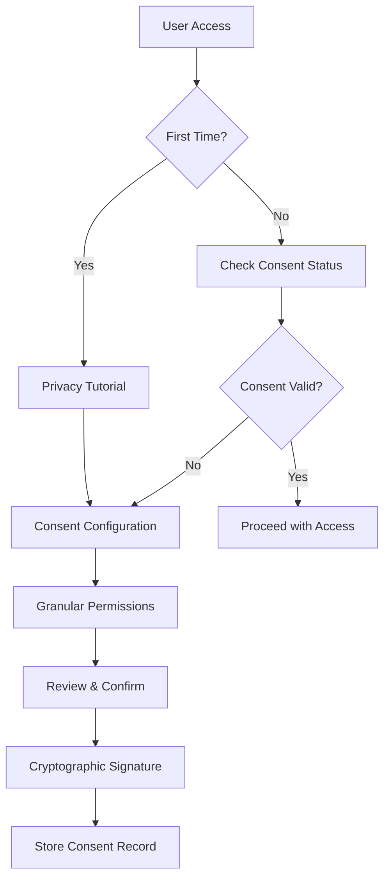

# C.H.R.I.S.T. Privacy & Consent Framework

Version: 1.0.0
Last Updated: 2025-01-20
Status: Draft

## Executive Summary

The C.H.R.I.S.T. Privacy Framework ensures that personal consciousness data is handled with the utmost respect for individual privacy, autonomy, and dignity. This framework establishes principles, technical controls, and governance processes that make privacy a fundamental, non-negotiable aspect of the system.

## Core Privacy Principles

### 1. Data Sovereignty
**Users own their data, period.**
- Full control over what is collected
- Complete visibility into what is stored
- Unrestricted right to modify or delete
- Portable data in standard formats

### 2. Privacy by Design
**Privacy is built-in, not bolted-on.**
- End-to-end encryption by default
- Minimal data collection principle
- Purpose limitation enforcement
- Privacy-preserving architecture

### 3. Informed Consent
**No surprises, ever.**
- Clear, granular consent options
- Plain language explanations
- Consent withdrawal at any time
- No dark patterns or coercion

### 4. Zero Knowledge Architecture
**We can't see what we don't need to see.**
- Client-side encryption
- No server-side decryption capability
- Cryptographic proof of operations
- Minimal metadata exposure

## Consent Management System

### Consent Levels

```yaml
CONSENT_LEVELS:
  NONE:
    description: "No data collection or processing"
    data_allowed: []
    retention: 0

  METADATA_ONLY:
    description: "Timestamps and counts only, no content"
    data_allowed: ["timestamps", "event_types", "counts"]
    retention: 90_days
    encryption: required

  ANONYMIZED:
    description: "Content with PII removed"
    data_allowed: ["anonymized_text", "patterns", "statistics"]
    retention: 1_year
    encryption: required
    pii_removal: automatic

  FULL:
    description: "Complete data with explicit consent"
    data_allowed: ["all"]
    retention: indefinite
    encryption: required
    review_required: quarterly
```

### Consent Flow



### Consent Record Schema

```json
{
  "consent_id": "uuid",
  "user_id": "encrypted_user_id",
  "timestamp": "2025-01-20T10:00:00Z",
  "version": "1.0",
  "permissions": {
    "consciousness_capture": {
      "email": "full",
      "messages": "anonymized",
      "photos": "metadata_only",
      "location": "none"
    },
    "analysis": {
      "pattern_detection": true,
      "sentiment_analysis": true,
      "relationship_mapping": false
    },
    "sharing": {
      "research": false,
      "family_access": ["spouse"],
      "emergency_access": true
    }
  },
  "expiry": "2026-01-20T10:00:00Z",
  "signature": "cryptographic_signature",
  "withdrawal_method": "api|ui|email"
}
```

## Data Protection Measures

### Encryption Standards

#### At Rest
```python
class EncryptionAtRest:
    """
    All data at rest must be encrypted.
    """
    algorithm = "AES-256-GCM"
    key_derivation = "Argon2id"
    key_rotation_days = 90

    # Per-field encryption for PII
    pii_fields = [
        "name", "email", "phone", "address",
        "ssn", "credit_card", "health_records"
    ]

    # Separate encryption keys per data type
    key_hierarchy = {
        "master": "HSM-protected",
        "data_encryption_keys": "Per-user",
        "field_encryption_keys": "Per-field"
    }
```

#### In Transit
```yaml
TLS_Configuration:
  minimum_version: "1.3"
  cipher_suites:
    - TLS_AES_256_GCM_SHA384
    - TLS_CHACHA20_POLY1305_SHA256
  certificate_pinning: enabled
  perfect_forward_secrecy: required
```

### Access Control

#### Role-Based Access Control (RBAC)
```json
{
  "roles": {
    "owner": {
      "permissions": ["read", "write", "delete", "share", "export"],
      "data_access": "all"
    },
    "trusted_family": {
      "permissions": ["read"],
      "data_access": ["shared_memories", "emergency_info"],
      "requires": "owner_approval"
    },
    "emergency_contact": {
      "permissions": ["read"],
      "data_access": ["emergency_info"],
      "activation": "incapacitation_protocol"
    },
    "researcher": {
      "permissions": ["read"],
      "data_access": ["anonymized_aggregates"],
      "requires": "irb_approval"
    }
  }
}
```

#### Attribute-Based Access Control (ABAC)
```python
def check_access(user, resource, action, context):
    """
    Fine-grained access control based on attributes.
    """
    rules = [
        # User must be authenticated
        user.is_authenticated,

        # User must own the resource or have delegation
        resource.owner == user.id or user.id in resource.delegated_to,

        # Time-based restrictions
        context.time.hour >= 6 and context.time.hour <= 22,

        # Location-based restrictions (optional)
        context.location in user.allowed_locations,

        # Consent must cover the action
        action in user.consent.permissions
    ]

    return all(rules)
```

## Privacy-Preserving Technologies

### Differential Privacy

```python
class DifferentialPrivacy:
    """
    Add noise to aggregate queries to prevent identification.
    """
    epsilon = 1.0  # Privacy budget
    delta = 1e-5   # Failure probability

    def add_laplace_noise(value, sensitivity):
        """Add calibrated noise to preserve privacy."""
        scale = sensitivity / epsilon
        noise = np.random.laplace(0, scale)
        return value + noise
```

### Homomorphic Encryption

```python
class HomomorphicOperations:
    """
    Perform computations on encrypted data.
    """
    supported_operations = [
        "addition",
        "multiplication",
        "comparison",
        "search"
    ]

    def encrypted_search(encrypted_query, encrypted_database):
        """Search without decrypting."""
        # Implementation using SEAL or similar library
        pass
```

### Secure Multi-Party Computation

```python
def federated_analysis(user_data_shards):
    """
    Analyze data across multiple users without pooling.
    """
    # Each user computes locally
    local_models = [train_local_model(shard) for shard in user_data_shards]

    # Aggregate without seeing individual data
    global_model = secure_aggregate(local_models)

    return global_model
```

## Data Minimization

### Collection Principles

1. **Purpose Limitation**: Collect only for specified purposes
2. **Data Minimization**: Collect minimum necessary
3. **Retention Limitation**: Delete when no longer needed
4. **Use Limitation**: Use only for consented purposes

### Automatic Data Reduction

```python
class DataMinimizer:
    """
    Automatically reduce data granularity over time.
    """

    retention_schedule = {
        "0-30_days": "full_fidelity",
        "31-90_days": "daily_aggregates",
        "91-365_days": "weekly_summaries",
        "1_year+": "monthly_statistics"
    }

    def age_data(self, data, age_days):
        """Progressive data reduction based on age."""
        if age_days <= 30:
            return data  # Keep full fidelity
        elif age_days <= 90:
            return self.create_daily_aggregate(data)
        elif age_days <= 365:
            return self.create_weekly_summary(data)
        else:
            return self.create_monthly_statistics(data)
```

## Right to be Forgotten

### Deletion Request Process

```python
class DeletionManager:
    """
    Handle GDPR Article 17 - Right to Erasure.
    """

    def process_deletion_request(self, user_id, scope="all"):
        """
        Complete data deletion with verification.
        """
        # 1. Verify user identity
        if not self.verify_identity(user_id):
            raise AuthenticationError()

        # 2. Identify all data locations
        locations = self.find_all_user_data(user_id)

        # 3. Create deletion record
        deletion_record = self.create_deletion_record(user_id, locations)

        # 4. Delete from all systems
        for location in locations:
            self.delete_data(location)
            self.verify_deletion(location)

        # 5. Cryptographic proof of deletion
        proof = self.generate_deletion_proof(deletion_record)

        # 6. Notify user
        self.send_deletion_confirmation(user_id, proof)

        return proof
```

### Deletion Verification

```sql
-- Verification queries to ensure complete deletion
SELECT COUNT(*) FROM events WHERE user_id = ?;
SELECT COUNT(*) FROM artifacts WHERE user_id = ?;
SELECT COUNT(*) FROM relationships WHERE source_user = ? OR target_user = ?;
SELECT COUNT(*) FROM audit_logs WHERE user_id = ? AND retention_required = false;
```

## Audit & Compliance

### Audit Logging

```json
{
  "audit_event": {
    "timestamp": "2025-01-20T10:00:00Z",
    "event_type": "data_access",
    "user_id": "hashed_user_id",
    "accessor_id": "hashed_accessor_id",
    "resource": "consciousness/events/2025-01",
    "action": "read",
    "justification": "user_request",
    "ip_address": "hashed_ip",
    "session_id": "encrypted_session",
    "result": "success"
  }
}
```

### Compliance Monitoring

```python
class ComplianceMonitor:
    """
    Continuous compliance checking.
    """

    def daily_compliance_check(self):
        checks = {
            "encryption_status": self.verify_all_encryption(),
            "consent_validity": self.check_consent_expiry(),
            "retention_compliance": self.enforce_retention_policies(),
            "access_anomalies": self.detect_unusual_access(),
            "cross_border_transfers": self.validate_data_residency()
        }

        report = self.generate_compliance_report(checks)

        if not report.compliant:
            self.trigger_incident_response(report.violations)

        return report
```

## Privacy Impact Assessment (PIA)

### Assessment Template

```markdown
## Privacy Impact Assessment

### 1. Data Collection
- **What**: [Specify data types]
- **Why**: [Business justification]
- **How**: [Collection methods]
- **When**: [Collection triggers]

### 2. Data Usage
- **Primary Purpose**: [Main use case]
- **Secondary Uses**: [Any additional uses]
- **Sharing**: [Third party sharing]
- **Retention**: [How long kept]

### 3. Privacy Risks
- **Risk 1**: [Description and mitigation]
- **Risk 2**: [Description and mitigation]

### 4. Safeguards
- **Technical**: [Encryption, access controls]
- **Organizational**: [Policies, training]
- **Physical**: [Facility security]

### 5. Individual Rights
- **Access**: [How users access their data]
- **Correction**: [How to correct errors]
- **Deletion**: [How to request deletion]
- **Portability**: [Export capabilities]
```

## International Compliance

### GDPR (European Union)

```python
GDPR_REQUIREMENTS = {
    "lawful_basis": ["consent", "legitimate_interest", "vital_interests"],
    "data_subject_rights": [
        "access", "rectification", "erasure", "portability",
        "restriction", "objection", "automated_decision_making"
    ],
    "breach_notification": "72_hours",
    "dpo_required": True,
    "privacy_by_design": True
}
```

### CCPA (California)

```python
CCPA_REQUIREMENTS = {
    "consumer_rights": [
        "know", "delete", "opt_out", "non_discrimination"
    ],
    "notice_requirements": [
        "at_collection", "privacy_policy", "sale_opt_out"
    ],
    "data_categories": "must_disclose",
    "service_provider_agreements": "required"
}
```

### Other Jurisdictions

- **LGPD** (Brazil): Similar to GDPR with local requirements
- **PIPEDA** (Canada): Consent and purpose limitation
- **POPIA** (South Africa): Accountability and openness
- **APPI** (Japan): Proper acquisition and accuracy

## Security Incident Response

### Incident Classification

```yaml
CRITICAL:
  description: "Mass data exposure or system compromise"
  response_time: immediate
  notification: [users, authorities, media]

HIGH:
  description: "Limited data exposure or attempted breach"
  response_time: 1_hour
  notification: [affected_users, authorities]

MEDIUM:
  description: "Potential vulnerability or anomaly"
  response_time: 4_hours
  notification: [affected_users]

LOW:
  description: "Minor security event"
  response_time: 24_hours
  notification: [internal_team]
```

### Response Playbook

```python
def incident_response(incident):
    """
    Standardized incident response procedure.
    """
    # 1. Contain
    isolate_affected_systems(incident.systems)

    # 2. Assess
    impact = assess_data_impact(incident)

    # 3. Notify
    if impact.severity >= "HIGH":
        notify_authorities(incident, within_hours=72)
        notify_affected_users(impact.user_list)

    # 4. Remediate
    patch_vulnerability(incident.vulnerability)
    restore_from_backup(incident.affected_data)

    # 5. Review
    post_mortem = conduct_review(incident)
    implement_improvements(post_mortem.recommendations)

    return incident_report
```

## Privacy-Preserving Features

### Anonymous Mode

```python
class AnonymousMode:
    """
    Use the system without storing identifying information.
    """

    def create_anonymous_session(self):
        session = {
            "id": generate_random_id(),
            "ephemeral_keys": generate_keypair(),
            "data_retention": "session_only",
            "features_available": ["analysis", "insights"],
            "features_disabled": ["persistence", "sharing"]
        }
        return session
```

### Data Portability

```python
def export_user_data(user_id, format="json"):
    """
    Export all user data in machine-readable format.
    """
    formats = {
        "json": export_as_json,
        "csv": export_as_csv,
        "sqlite": export_as_sqlite,
        "tensorflow": export_as_tf_dataset
    }

    data = collect_all_user_data(user_id)
    encrypted_export = formats[format](data)

    # Sign the export for integrity
    signature = sign_data(encrypted_export)

    return {
        "data": encrypted_export,
        "signature": signature,
        "schema_version": CURRENT_SCHEMA_VERSION,
        "export_date": datetime.now().isoformat()
    }
```

## Privacy Education

### User Education Materials

1. **Privacy Tutorial**: Interactive guide on first use
2. **Privacy Dashboard**: Real-time view of data and permissions
3. **Privacy Tips**: Regular tips on protecting privacy
4. **Transparency Reports**: Quarterly reports on data requests

### Developer Training

```python
PRIVACY_TRAINING_MODULES = [
    "Privacy by Design Principles",
    "Secure Coding Practices",
    "Data Minimization Techniques",
    "Encryption Implementation",
    "Incident Response Procedures",
    "Regulatory Compliance",
    "Ethical Considerations"
]
```

## Transparency Reporting

### Quarterly Transparency Report

```json
{
  "period": "Q1 2025",
  "statistics": {
    "active_users": 10000,
    "data_requests": {
      "government": 5,
      "law_enforcement": 3,
      "civil": 2
    },
    "requests_complied": 2,
    "requests_rejected": 8,
    "deletion_requests": 150,
    "deletions_completed": 150,
    "breaches": 0,
    "vulnerabilities_patched": 12
  }
}
```

## Ethical Considerations

### Privacy Ethics Board

- Independent review of privacy practices
- Quarterly assessments
- Public recommendations
- User advocate representation

### Ethical Guidelines

1. **Do No Harm**: Never use data to harm users
2. **Transparency**: Be open about data practices
3. **User Agency**: Empower users with control
4. **Beneficence**: Use data only for user benefit
5. **Justice**: Fair and equitable treatment

## Future Privacy Enhancements

### Roadmap

1. **Quantum-Resistant Encryption** (2025 Q3)
2. **Decentralized Identity** (2025 Q4)
3. **Zero-Knowledge Proofs** (2026 Q1)
4. **Federated Learning** (2026 Q2)
5. **Blockchain Audit Trail** (2026 Q3)

## Contact Information

**Privacy Officer**: privacy@christproject.org
**Data Protection Officer**: dpo@christproject.org
**Security Team**: security@christproject.org

**Regulatory Inquiries**: legal@christproject.org
**User Support**: support@christproject.org

---

*This privacy framework is a living document and will be updated regularly to reflect best practices and regulatory changes.*

*Last Review: 2025-01-20*
*Next Review: 2025-04-20*